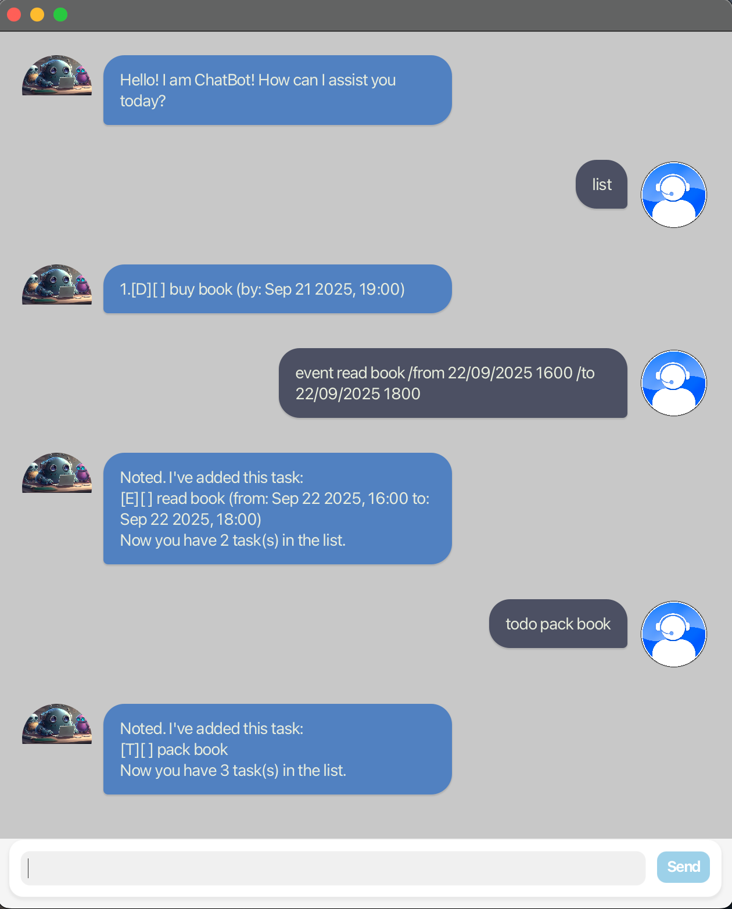

# ChatBot User Guide



ChatBot is a personal task management application that allows users to create, modify, and query three types of tasks: todos, deadlines, and events. The system provides dual interfaces - a text-based console interface and a JavaFX graphical interface - while maintaining persistent storage of all task data.

The application supports comprehensive task operations including creation, deletion, status updates, keyword-based searching, and intelligent scheduling features such as finding available time slots between existing commitments.

## Adding Tasks
Note: DATEs are passed in the format: d/M/yyyy HHmm

### 1. Deadlines

**Format: `deadline NAME /by DATE`**

Example: `deadline buy book /by 21/09/2025 1900`

```
Noted. I've added this task:
[D][ ] buy book (by: Sep 21 2025, 19:00)
Now you have ? task(s) in the list.
```

### 2. Events

**Format: `event NAME /from DATE1 /to DATE2`**


Example: `event read book /from 22/09/2025 1600 /to 22/09/2025 1800`

```
Noted. I've added this task:
[E][ ] read book (from: Sep 22 2025, 16:00 to: Sep 22 2025, 18:00)
Now you have ? task(s) in the list.
```

### 3. Todos

**Format: `todo NAME`**


Example: `todo pack book`

```
Noted. I've added this task:
[T][ ] pack book
Now you have ? task(s) in the list.
```

## Marking Tasks

Note: INDEX starts from 1

### 1. Completed

**Format: `mark INDEX`**

Example: `mark 1`

```
Nice! I've marked this task as done:
[D][X] buy book (by: Sep 21 2025, 19:00)
```

### 2. Uncompleted

**Format: `unmark INDEX`**

Example: `unmark 1`

```
OK, I've marked this task as not done yet:
[D][X] buy book (by: Sep 21 2025, 19:00)
```

# Delete Tasks

**Format: `delete INDEX`**

Example: `delete 1`

```
Noted. I've removed this task:
[D][] buy book (by: Sep 21 2025, 19:00)
Now you have ? task(s) in the list.
```

# Search Tasks

Note: Performs case-insensitive matching using word boundaries, so searching for "book" will match tasks containing the word "book" but not "booking"

**Format: `find KEYWORD`**

Example: `find read`

```
Here are the matching tasks in your list:
1. [E][] read book (from: Sep 22 2025, 16:00 to: Sep 22 2025, 18:00)
```

# Find Free Times
Note: Finds available time slots of a specified duration (in hours) by analyzing scheduled events and calculating gaps between them

**Format: `free /duration HOURS`**

Example: `free /duration 4` at Sep 14 2025, 18:18

```
Your next available free time slot is from
Sep 14 2025, 18:18 to Sep 14 2025, 22:18.
```

Example: `free /duration 4` at Sep 22 2025, 16:00

```
Your next available free time slot is from
Sep 22 2025, 18:00 to Sep 14 2025, 22:00.
```
